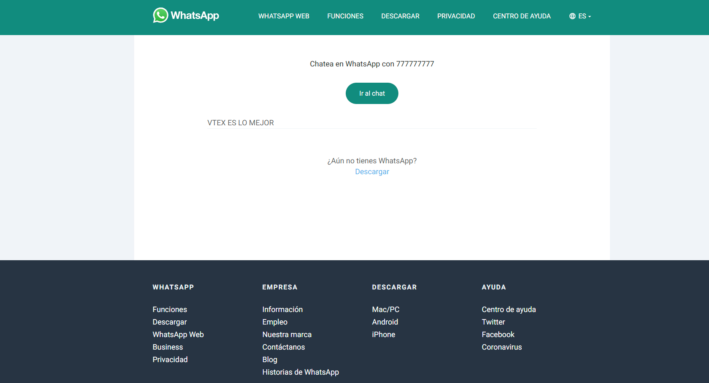

# WHATSAPP BUTTON

This component allows users write direct whatsapp messages. You can set image logo, telephone number, message and button size. The button has a fixed position on the bottom.

### Button example


### Example redirect button 


## Configuration 
### **Step 1** -  Basic setup

Access the VTEX IO [basic setup guide](https://vtex.io/docs/getting-started/build-stores-with-store-framework/1) and follow all the given steps. 

By the end of the setup, you should have the VTEX command line interface (Toolbelt) installed along with a developer workspace you can work in.

---
### **Step 2** - Cloning the repository

[Clone](https://help.github.com/en/github/creating-cloning-and-archiving-repositories/cloning-a-repository) this repository to your local files to be able to effectively start working on it.

Then, access the repository's directory using your terminal. 

---

### **Step 3** - Link this repository to your current project

Then time has come to upload all the changes you made in your local files to the platform. For that, use the `vtex link` command. 

If the process runs without any errors, the following message will be displayed: `App linked successfully`. Then, run the `vtex browse` command to open a browser window having your linked store in it.

This will enable you to see the applied changes in real time, through the account and workspace in which you are working.

---

### **Step 4** - Adding the app on your project

1. Adding the app as a theme dependency in the `manifest.json` file;
```json
  "dependencies": {
    "itgloberspartnercl.whatsapp-button": "0.x"
  }
```
2. Declaring the app's main block in a given theme template or inside another block from the theme.

```json
{
  "responsive-layout.desktop#home__wp-button": {
    "title": "Whatsapp Button",
    "children": ["whatsapp-button"]
  },
  "whatsapp-button": {
    "props": {
      "logo": "assets/img/wp-icon.png",
      "phone": "777777777",
      "message": "VTEX ES LO MEJOR",
      "width": 70,
      "height": 70
    }
  }
}
```
### **Step 5** -  Installing required apps

In order to use Store Framework and work on your store theme, it is needed to have both `vtex.store-sitemap` and `vtex.store` installed.

Run  `vtex list`  and check whether those apps are already installed. 

If they aren't, run the following command to install them: 

`vtex install vtex.store-sitemap vtex.store -f`

---
### **Step 6** -  Check the app is connected

By running `vtex list`,  you can verify if the app is linked. On your Linked Apps you must have 

```json
itgloberspartnercl.whatsapp-button             0.0.1
```

---
## Customization

`No CSS Handles are available yet for the app customization.`

<!-- DOCS-IGNORE:start -->

## Contributors ✨

Thanks goes to these wonderful people:
1. Enuar Montaña

---- 

